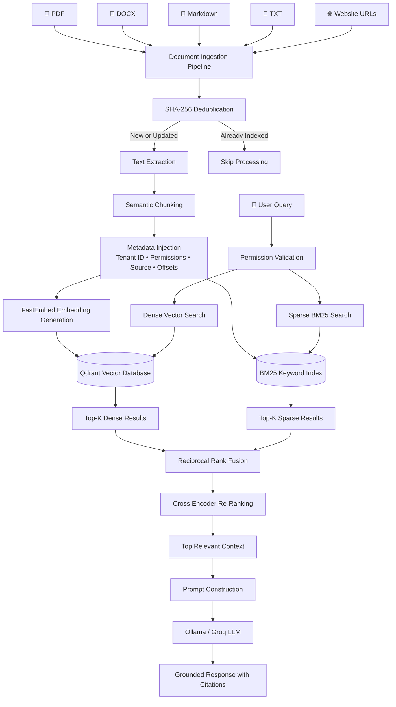

🧠 Local RAG - Privacy-First Enterprise Retrieval-Augmented Generation

A fully local, privacy-focused Retrieval-Augmented Generation (RAG) system featuring Hybrid Retrieval, Semantic Chunking, Cross-Encoder Re-ranking, Multi-Tenant Security, and High-Speed Document Indexing.

📖 Overview

Local RAG is an enterprise-grade Retrieval-Augmented Generation (RAG) system designed to run completely on local infrastructure without exposing sensitive data to third-party cloud providers.

Unlike traditional RAG systems that rely solely on vector similarity search, Local RAG combines dense semantic retrieval, sparse keyword retrieval, advanced reranking, and intelligent semantic chunking to produce highly accurate and explainable responses.

The system supports multiple document formats, website ingestion, permission-aware retrieval, and sub-10ms cached responses while ensuring complete data privacy.

✨ Features
🔒 100% Local Execution
📄 Multi-document ingestion
🌐 Website URL ingestion
🧠 Semantic Chunking
⚡ FastEmbed ONNX Embeddings
🗂 Qdrant Vector Database
🔍 BM25 Keyword Search
🔀 Hybrid Retrieval Pipeline
🎯 Reciprocal Rank Fusion (RRF)
🏆 ONNX Cross-Encoder Re-ranking
👥 Multi-Tenant Architecture
🛡 Role-Based Access Control
📑 Exact Character-Level Citations
🚀 Parallel Multi-threaded Indexing
⚡ Sub-10ms Query Cache
♻ SHA-256 Document Deduplication
🎯 Why Local RAG?

Traditional RAG systems suffer from several limitations:

Sensitive documents are uploaded to cloud APIs.
Vector search often misses exact keywords.
Duplicate files are reprocessed repeatedly.
No permission-aware retrieval.
Poor citation support.
High latency.

Local RAG addresses all of these problems by combining modern retrieval techniques with complete local execution.

🚀 Key Capabilities
Document Ingestion

Supports:

PDF
DOCX
Markdown
TXT
HTML
Website URLs
Semantic Chunking

Instead of splitting documents using fixed token sizes, Local RAG:

Splits text into sentences
Generates embeddings
Computes semantic similarity
Detects topic changes
Creates dynamic semantic chunks

This preserves contextual meaning and improves retrieval accuracy.

Hybrid Search

The retrieval engine combines two independent search systems:

Dense Vector Search (Qdrant)
Sparse Keyword Search (BM25)

Both rankings are merged using Reciprocal Rank Fusion (RRF), significantly improving recall and precision.

Cross-Encoder Re-ranking

Top retrieved chunks are passed through an ONNX Cross-Encoder model which evaluates the query and document together to produce highly accurate relevance scores before sending context to the LLM.

Security

Designed for enterprise environments.

Features include:

Multi-tenant isolation
Permission-aware retrieval
Local execution
No cloud dependency
Secure document storage
Performance Optimizations
Parallel embedding generation
Dynamic multithreading
SHA-256 deduplication
Query caching
Smart short-document optimization

## 🏗️ System Architecture




🛠 Tech Stack
Backend
Python
Vector Database
Qdrant
Embeddings
FastEmbed
ONNX Runtime
Retrieval
BM25
Hybrid Search
Reciprocal Rank Fusion
Re-ranking
ONNX MiniLM Cross Encoder
LLM
Ollama
Groq API
Document Processing
PyMuPDF
python-docx
BeautifulSoup
Markdown
Caching
In-memory FIFO Cache

## 📂 Project Structure

```text
Local-RAG/
│
├── app.py                     # Main application entry point
├── config.py                  # Project configuration
├── requirements.txt
├── README.md
│
├── data/
│   ├── uploads/               # Uploaded documents
│   ├── scraped/               # Scraped webpages
│   ├── processed/             # Processed text files
│   └── cache/
│
├── ingestion/
│   ├── loaders.py             # PDF, DOCX, TXT, MD loaders
│   ├── scraper.py             # Website scraping
│   ├── hashing.py             # SHA-256 deduplication
│   ├── chunker.py             # Semantic chunking
│   └── metadata.py            # Metadata generation
│
├── embeddings/
│   ├── embedder.py            # FastEmbed integration
│   └── models/
│
├── vectorstore/
│   ├── qdrant.py              # Qdrant operations
│   ├── bm25.py                # BM25 indexing
│   └── indexing.py
│
├── retrieval/
│   ├── dense_search.py
│   ├── sparse_search.py
│   ├── rrf.py                 # Reciprocal Rank Fusion
│   ├── reranker.py            # Cross Encoder
│   └── retrieval_pipeline.py
│
├── llm/
│   ├── prompt_builder.py
│   ├── ollama.py
│   └── groq.py
│
├── security/
│   ├── permissions.py
│   ├── tenant_filter.py
│   └── authentication.py
│
├── cache/
│   └── query_cache.py
│
├── utils/
│   ├── logger.py
│   ├── helpers.py
│   └── constants.py
│
├── static/
│
├── templates/
│
└── images/                    # README screenshots
```

⚙️ Installation

git clone https://github.com/yourusername/local-rag.git

cd local-rag

pip install -r requirements.txt

▶️ Running the Project

Start the Qdrant server.

docker compose up -d

Start Ollama.

ollama serve

Run the application.

python app.py

📊 Comparison with Traditional RAG
## 📊 Comparison with Traditional RAG Systems

| Feature | Traditional RAG | Local RAG |
|----------|-----------------|-----------|
| Deployment | Cloud-based | Fully Local |
| Data Privacy | Documents sent to external APIs | Data never leaves local machine |
| Embedding Model | OpenAI / API-based | FastEmbed (ONNX) |
| Vector Database | Pinecone / FAISS | Qdrant |
| Search Method | Dense Vector Search | Hybrid Search (Dense + BM25) |
| Keyword Retrieval | ❌ | ✅ |
| Semantic Retrieval | ✅ | ✅ |
| Hybrid Retrieval | ❌ | ✅ |
| Rank Fusion | ❌ | Reciprocal Rank Fusion (RRF) |
| Re-ranking | Rarely Used | ONNX Cross Encoder |
| Semantic Chunking | Fixed-size chunks | Dynamic Semantic Chunking |
| Document Deduplication | ❌ | SHA-256 Hashing |
| Multi-threaded Indexing | ❌ | ✅ |
| Query Cache | ❌ | FIFO In-Memory Cache |
| Multi-Tenant Support | ❌ | ✅ |
| Role-Based Access Control | ❌ | ✅ |
| Exact Character Citations | ❌ | ✅ |
| Website Ingestion | Limited | Built-in |
| Multi-file Upload | Basic | Drag-and-Drop |
| Offline Support | Limited | Fully Offline |
| Cost | API Charges | Free Local Execution |
| Enterprise Ready | Partial | Yes |

📈 Future Improvements
Multi-modal document retrieval
Image understanding
Audio document support
Incremental vector updates
Distributed Qdrant clusters
Knowledge graph integration
Agentic RAG workflows
Fine-tuned embedding models
📸 Implementation
User Interface


📚 References
Retrieval-Augmented Generation (RAG)
Qdrant Vector Database
FastEmbed
BM25 Ranking
Reciprocal Rank Fusion (RRF)
ONNX Runtime
MiniLM Cross Encoder
Ollama


🤝 Contributing

Contributions, feature requests, and bug reports are welcome. Feel free to fork the repository and submit pull requests.


This project is licensed under the MIT License.

⭐ Support

If you found this project useful, consider giving it a ⭐ on GitHub!
